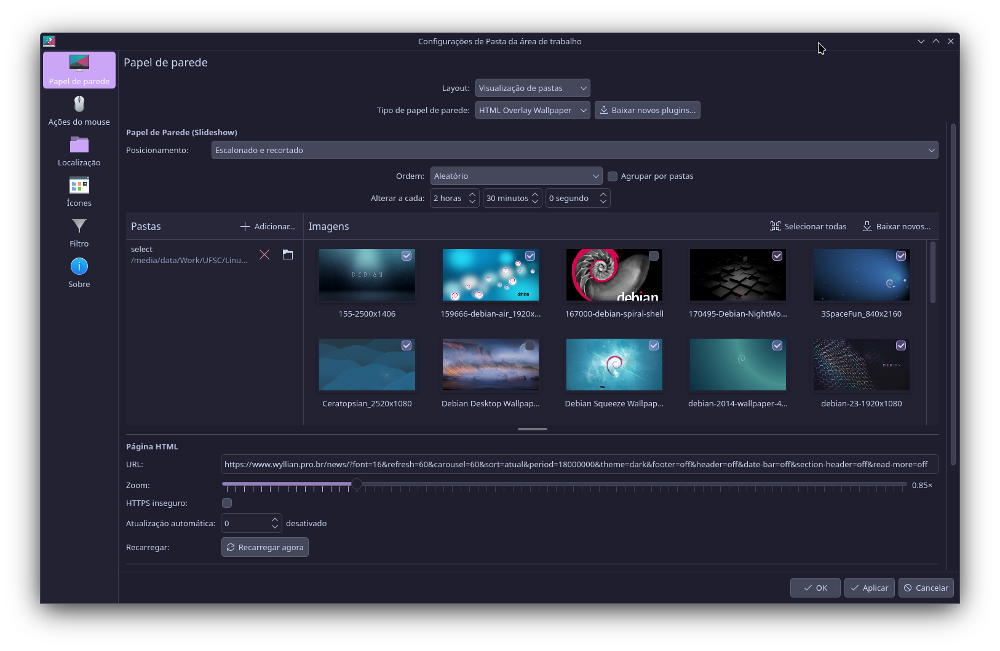
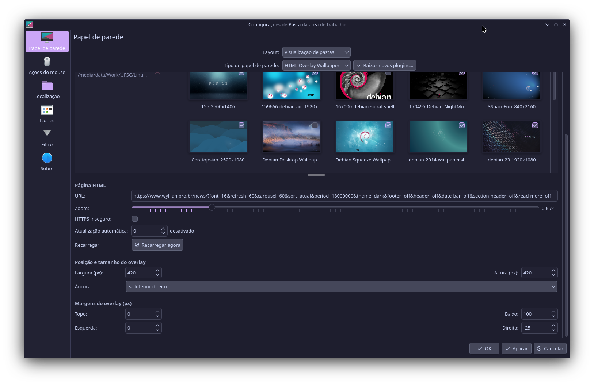
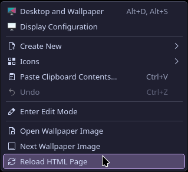

<p align="center">
  
</p>

<p align="center">
  <a href="https://store.kde.org/p/2370813/"></a>
</p>

# HTML Overlay Wallpaper

A KDE Plasma 6 wallpaper plugin that shows a **native image slideshow** as the
background and renders an **HTML page in a configurable region** on top of it —
useful for dashboards, news tickers, clocks, stats, or any web widget.

> Not to be confused with the existing *HTML Wallpaper* plugin: this one keeps a
> real Plasma slideshow underneath and places the web page as a positioned
> *overlay* over it.




<p align="center">
  
</p>

## Features

- Native background slideshow (folders, order, interval, blur, fill mode) —
  built on top of the official `org.kde.image` backend.
- Per-image selection: include/exclude individual pictures from the slideshow,
  with a single **Select all / Deselect all** toggle.
- HTML overlay via `WebEngineView`:
  - Any URL (`https://…`) or local file (`file:///…`).
  - Configurable **anchor**, **size** and **margins** — place it anywhere.
  - **Zoom** factor, **insecure HTTPS** toggle, **auto-refresh** interval.
  - **Reload** on demand: from the desktop right-click menu *and* a button in
    Settings.
- Resizable thumbnail area and thumbnails that scale with the Settings window.
- Translated into English, Portuguese (BR), Spanish, German, Italian and French.

## Requirements

- KDE Plasma 6 / KDE Frameworks 6 / Qt 6
- Qt 6 WebEngine QML module (for the HTML overlay)
  - Debian/Ubuntu: `sudo apt install qml6-module-qtwebengine`
  - Fedora: `sudo dnf install qt6-qtwebengine`
  - Arch: `sudo pacman -S qt6-webengine`
- `gettext` (only to build the translation catalogs): `sudo apt install gettext`

## Installation

### From the KDE Store (easiest)

Product page:
- KDE Store: **https://store.kde.org/p/2370813/**
- OpenDesktop: **https://www.opendesktop.org/p/2370813/**

Right-click the desktop → **Configure Desktop and Wallpaper** →
**Wallpaper type** → **Get New Plugins…**, then search for *HTML Overlay
Wallpaper*. You can also download the package directly from the store page above.

### Manual install (no cmake required)

```bash
git clone https://github.com/wyllianbs/HTMLOverlayWallpaper.git
cd HTMLOverlayWallpaper
./build.sh
kquitapp6 plasmashell && kstart plasmashell
```

`build.sh` installs the package with `kpackagetool6` and compiles the
translation catalogs into your user locale directory.

### From source (cmake / KDE standard)

```bash
cmake -B build -DCMAKE_INSTALL_PREFIX=$(kf6-config --prefix)
cmake --build build
sudo cmake --install build
```

This uses `ki18n_install(po)` to install the translations system-wide.

## Usage

After installing, set **Wallpaper type** to *HTML Overlay Wallpaper* and
configure:

- **Wallpaper (Slideshow)** — folders, order, interval, positioning, blur.
- **Images** — tick the pictures to use; use the toggle in the header to select
  or deselect all at once.
- **HTML Page** — the URL, zoom, insecure-HTTPS, auto-refresh, and a manual
  *Reload now* button.
- **Overlay Position and Size** / **Overlay Margins** — where the page appears.

To reload the page at any time without opening Settings, right-click the desktop
and choose **Reload HTML Page**.

## Packaging (maintainers)

`./package.sh` bundles the compiled translations into the package and produces
`io.github.wyllianbs.htmloverlaywallpaper-<version>.tar.gz`, ready to upload to
the KDE Store.

## Translations

Source strings are in English. Catalogs live in `po/<lang>/`. To add or update a
language, edit the corresponding `.po` file (or copy the `.pot` template) and
rebuild. Contributions welcome.

## Credits & License

- Licensed under **LGPL-2.0-or-later**.
- Based on the original *HTML Wallpaper* by **Marcel1202**
  (https://github.com/Marcel1202/HTMLWallpaper), and on the official KDE
  `org.kde.image` slideshow components.
- Maintained by **Wyllian Bezerra da Silva**.
